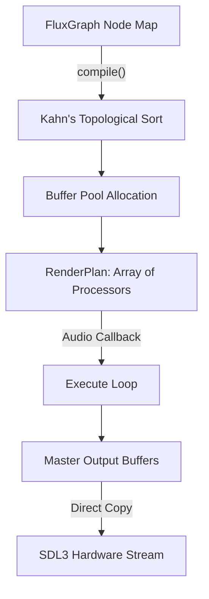
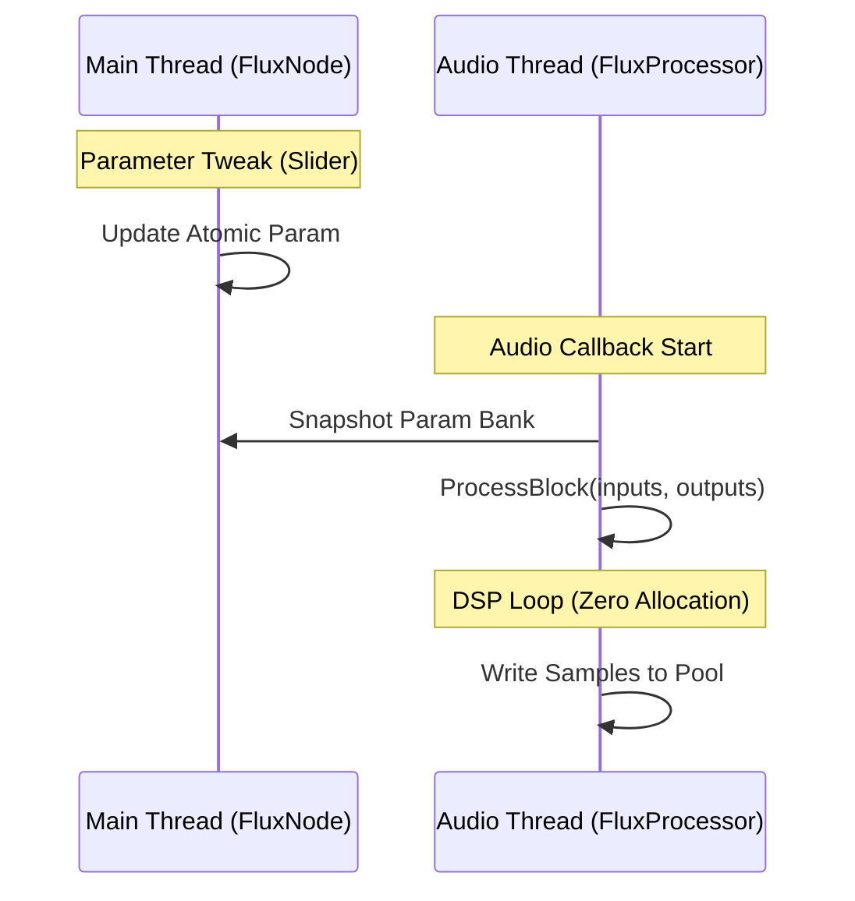

# Beam Audio Flux - Technical Architecture (v2.0)

## 1. Overview
Beam Audio Flux 2.0 is a high-performance DAW built on the **BeamEngine**. It uses a "Model/Processor" decoupled architecture to ensure deterministic real-time processing and a stable, high-refresh-rate UI.

## 2. Audio Engine: Decoupled Processing

### 2.1 The Model (`FluxNode`)
The `FluxNode` represents the persistent state and user-facing identity of a DSP entity. It lives on the **Main Thread** and handles:
- **Parameters**: Thread-safe UI controls.
- **Serialization**: Saving/Loading state to JSON.
- **UI Generation**: Creating localized views for the workspace.

### 2.2 The Worker (`FluxProcessor`)
The `FluxProcessor` is a real-time-safe worker that lives on the **Audio Thread**. It is created by a node via `createProcessor()`.
- **Zero Allocation**: Processors never allocate memory after initialization.
- **Direct Buffering**: They operate on raw pointer arrays provided by the `RenderPlan`.
- **Minimal Virtual Calls**: The processing sequence is flattened into a static plan.

### 2.3 `RenderPlan` & `FluxGraph`
Instead of traversing a linked graph in the audio callback, the `FluxGraph` "compiles" the topology into a `RenderPlan`.
- **Static Execution**: A pre-sorted sequence of processor identifiers.
- **Buffer Pool**: Centrally managed memory to minimize pointer chasing.
- **Master Sink**: Direct output tracking for zero-copy hardware transfer.

## 3. Decoupled Model/Processor Architecture

Beam 2.0 strictly separates state from processing:

## 4. Rendering Engine (`QuadBatcher`)

- **Batching**: OpenGL batch renderer minimizing draw calls.
- **SDF Shaders**: High-fidelity primitives (rounded rects, anti-aliased lines).
- **Coordinate Clipping**: Hardware-accelerated scissoring via `pushClip()`.

## 4. Unified UI System

### 4.1 Local Coordinate System
In Beam 2.0, all components use **localized coordinates (0, 0)**. 
- **Deterministic**: A child's position is always relative to its parent's top-left corner.
- **Modular**: Components can be moved or nested without updating their internal layout logic.
- **Offset Stack**: `QuadBatcher::pushOffset()` handles the global translation automatically.

### 4.2 BeamShell Shell Architecture
The DAW surface is divided into a deterministic "Shell" and a modular "Workspace":
- **BeamHost**: Owns high-level components (`TopBar`, `Sidebar`, `MasterStrip`).
- **Workspace**: A modular view hosting the dynamic node graph.
- **Direct Sink**: Master Channel output is directly linked to the engine output buffers for absolute lowest latency.

## 5. Development Guidelines
- **Real-Time Safety**: Never use `std::vector` (resize/push_back) or `new` inside a `FluxProcessor`.
- **Local Layout**: In `resized()`, always position children relative to `(0, 0)`.
- **Processor Sync**: Use the parameter bank provided in `FluxProcessor::process` for frame-accurate control updates.